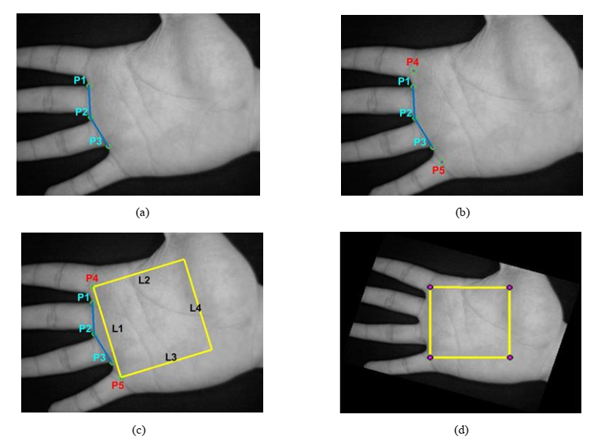

## Palmprint Identification using BPNN, KNN, PNN, RBFN, and RBPNN

This project presents an effective texture-based
approach for palmprint recognition. It has three major steps - 

 - First, region of interest (ROI) is extracted from the hand image.
 - Then, features are extracted in the processing stage from the
palmprint texture using discrete cosine transform (DCT). Block-wise DCT and Holistic DCT 
are used to extract features. 
- Finally, following machine learning approaches are used for classification -
  - Back-propagation neural network (BPNN)
  - K-nearest neighbor (KNN)
  - Probabilistic neural network (PNN)
  - Radial basis function network (RBFN)
  - Radial basis probabilistic neural network (RBPNN)
 
#### Dataset
[CASIA Database](http://www.cbsr.ia.ac.cn/english/Palmprint%20Databases.asp "CASIA_database")

#### Experimental setup
See Reference [1].

#### Screen shot

#### Reference

[1] Mrinal Kanti Dhar, Rupak Kanti Dhar, Md. Sanwar Hussain, Mamunul Islam, and Yousha Fatema Rahman, Palmprint Identification Using Radial Basis Probabilistic Neural Network, in: Proceedings of IEEE International Conference on Power, Control, Signals and Instrumentation Engineering (ICPCSI), pp. 49-53, 2017.

[2] ROI of Palmprint Images (https://www.mathworks.com/matlabcentral/fileexchange/46573-roi-of-palmprint-images), MATLAB Central File Exchange. 
